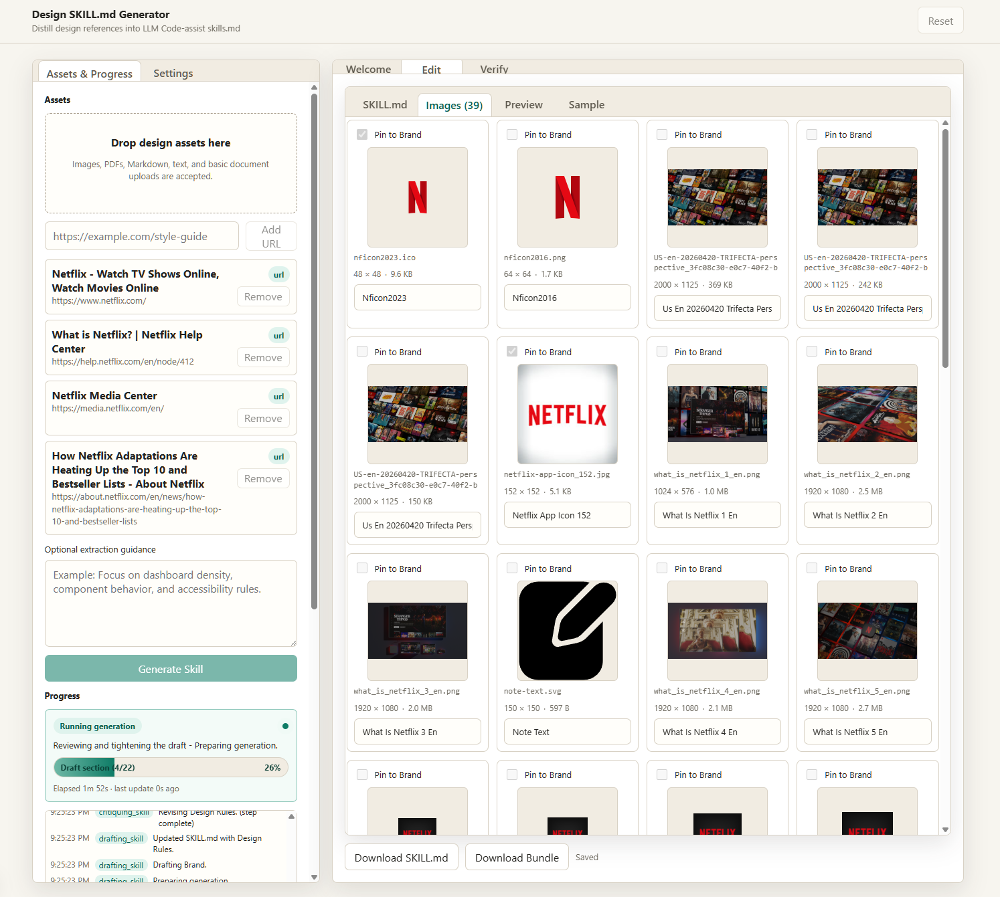
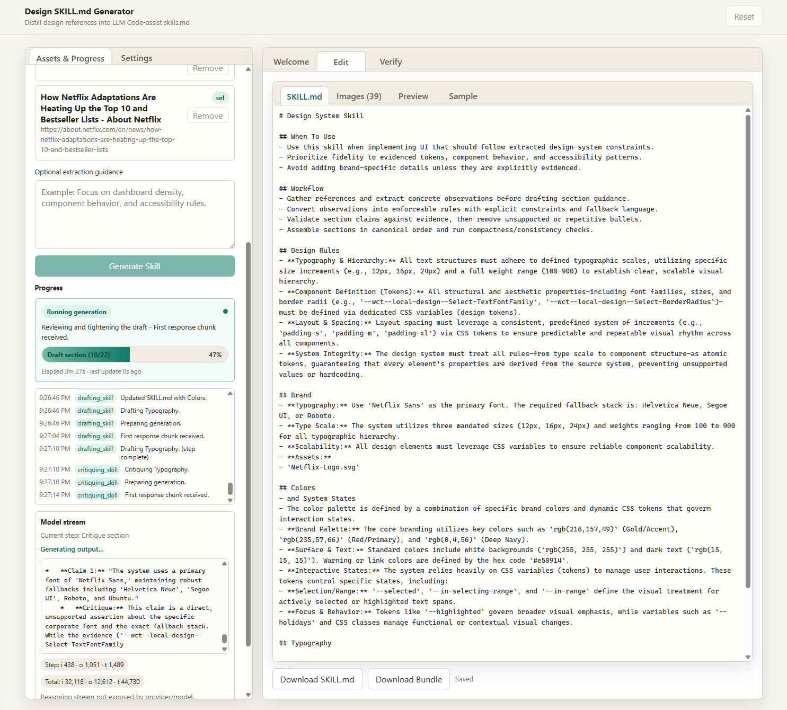
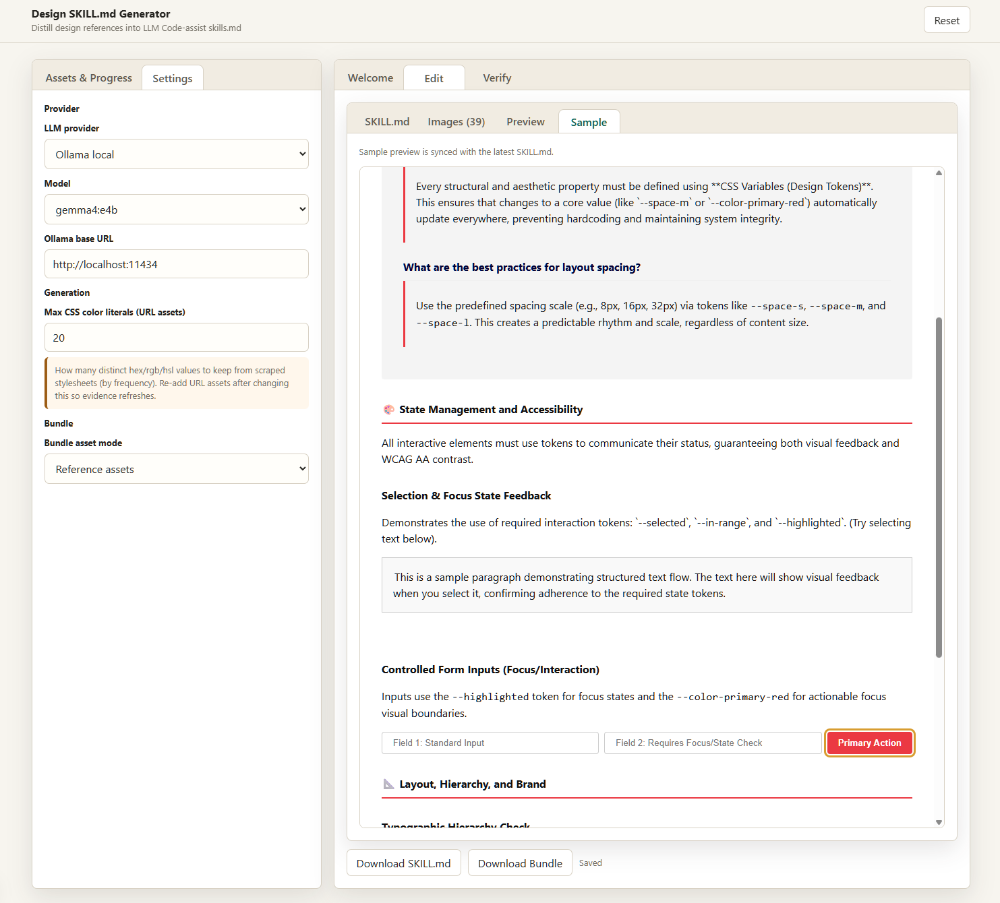

# Design SKILL.md Generator

A local [Next.js](https://nextjs.org/) app that helps you draft and verify **design-system–oriented** agent skills (`SKILL.md`). Add example URLS, upload design references (images and text), run a guided generation workflow against **OpenAI** or **local Ollama**, then review markdown, previews, and sample outputs.

## Screenshots







## Features

- Multi-step generation with progress and token usage
- OpenAI (cloud) and Ollama (local) providers, configurable in the UI
- Asset upload, session persistence via API routes, and optional verification pass
- Export-friendly workflow aligned with design skill sections

## Prerequisites

Install the following before cloning the repository.

| Requirement | Notes |
|-------------|--------|
| **Node.js** | **18.18+** or **20.x LTS** (recommended). Next.js 15 expects a current Node release; older majors may fail to build or run. |
| **npm** | Bundled with Node; used for installs and scripts. **pnpm** or **yarn** work if you prefer, but commands below assume `npm`. |
| **Git** | To clone the repository. |
| **Bash** (optional) | Required only if you use `./server.sh` or `npm run server` / `npm run srv`. On Windows, use **Git Bash** or **WSL**; the script relies on bash, `nohup`, and Windows helpers for process management. |

You do **not** need a global Next.js install; the project brings it in as a dependency.

### Optional: Ollama

To use the **Ollama** provider, install [Ollama](https://ollama.com/) and pull at least one chat model. The app defaults to `http://localhost:11434` unless you change the base URL in the UI.

### Optional: OpenAI

For **OpenAI**, you need an API key from the [OpenAI platform](https://platform.openai.com/). Keys are entered in the app UI (not required at install time).

---

## Installation

### 1. Clone the repository

```bash
git clone <repository-url>
cd design-skills
```

Use your fork or the upstream URL in place of `<repository-url>`.

### 2. Install dependencies

From the project root (the directory that contains `package.json`):

```bash
npm install
```

For a reproducible install that matches the lockfile (recommended for this repo):

```bash
npm ci
```

Use `npm install` instead if you intentionally need to refresh or alter the lockfile.

### 3. Verify the install

```bash
npm run build
```

A successful production build confirms Node, dependencies, and TypeScript wiring. You can skip this during day-to-day development if you only plan to run `npm run dev`.

### 4. Optional environment variables

The app runs without a `.env` file for typical use (API keys and Ollama URL are set in the browser).

For **server-side workflow experiments**, you can set variables recognized by the generator (all optional):

| Variable | Effect |
|----------|--------|
| `SECTION_FIRST_GENERATION` | Set to `0` to disable section-first generation (default: enabled). |
| `SECTION_EVIDENCE_COMPILER` | Set to `1` to enable. |
| `SECTION_EVIDENCE_SHADOW` | Set to `1` to enable. |
| `SECTION_CLAIM_VALIDATION` | Set to `1` to enable. |
| `SECTION_EVIDENCE_DIAGNOSTICS` | Set to `1` to enable. |
| `SECTION_STATIC_BASELINES` | Set to `0` to disable static baselines (default: enabled). |

Create a `.env.local` in the project root (Next.js loads it automatically) **or** export variables in your shell before `npm run dev` / `npm run start`.

---

## Running the application

### Development (hot reload)

```bash
npm run dev
```

By default the dev server listens on **http://localhost:3000**. To use another port:

```bash
npx next dev --port 3001
```

Or with npm’s argument forwarding:

```bash
npm run dev -- --port 3001
```

Open the printed URL in your browser. Large request bodies (e.g. assets) are allowed up to **20mb** per the Next.js config.

### Production build and server

```bash
npm run build
npm run start
```

`npm run start` serves the optimized build; the default is still **http://localhost:3000** unless you set the `PORT` environment variable (Next.js convention).

Example:

```bash
PORT=3001 npm run start
```

On **Windows CMD**:

```cmd
set PORT=3001 && npm run start
```

On **Windows PowerShell**:

```powershell
$env:PORT=3001; npm run start
```

### Background dev server (bash helper)

The repo includes `server.sh` for starting the dev server in the background with a fixed port and log file (oriented toward **Git Bash on Windows**, with `APP_PORT` default **3001**).

```bash
chmod +x ./server.sh   # once, if needed
./server.sh start      # start in background
./server.sh status     # check pid, port, log path
./server.sh stop       # stop using saved pid
./server.sh reset      # stop then start
```

Or via npm:

```bash
npm run server -- start
```

Set a custom port:

```bash
APP_PORT=3002 ./server.sh start
```

Logs are written to `.next/dev-server.log`. If the port is already taken by a non-project process, the script exits without killing that process.

---

## Other npm scripts

| Script | Command | Purpose |
|--------|---------|---------|
| **Lint** | `npm run lint` | Next.js ESLint |
| **Tests** | `npm run test` | Vitest unit tests (`vitest run`) |

---

## Project structure (high level)

- `app/` — Next.js App Router pages and `app/api/*` route handlers
- `lib/` — Generation workflow, providers (OpenAI / Ollama), assets, types
- `server.sh` — Optional background dev server control

---

## Troubleshooting

- **`npm run build` fails** — Confirm Node version (`node -v`) is 18.18+ or a supported 20.x LTS; delete `node_modules` and reinstall if dependencies are corrupted.
- **Port already in use** — Stop the other process or pass `--port` / set `PORT` / `APP_PORT` as above.
- **`server.sh` fails on Windows** — Run it from **Git Bash** (or WSL), not CMD, unless you have bash in PATH.
- **Ollama connection errors** — Ensure Ollama is running and the base URL in the UI matches your daemon (default `http://localhost:11434`).

---

## Contributing

Issues and pull requests are welcome. Please run `npm run lint` and `npm run test` before submitting changes when applicable.
